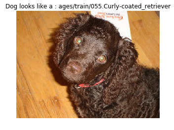
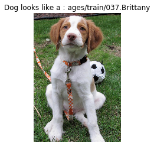
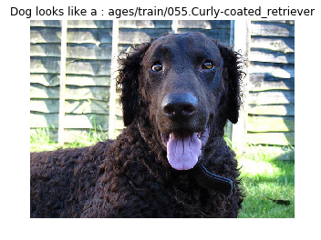
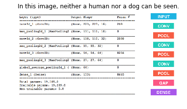
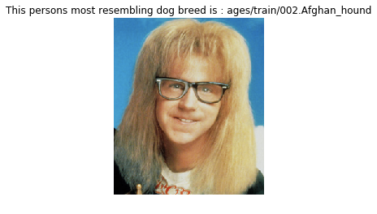
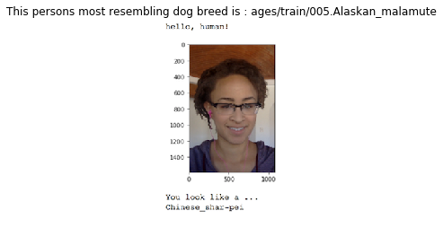

# Dog-Breed-Classifier

## Project Definition 

## Project Overview

Welcome to the Data Scientist Nanodegree's Dog Breed Classifier using Convolutional Neural Networks (CNN) capstone project! I designed a pipeline that was utilised in a web app to handle real-world, user-supplied photographs in this project. This web programme will identify an estimate of a dog's breed based on an image of the dog. If a human image is provided, the app will identify the dog breed that most closely resembles it.

## Problem Statement

We need to create an algorithm for our web app that takes a file path to an image and decides whether it contains a human, a dog, or neither. Then,

Return the anticipated breed if a dog is detected in the image.

2. If a human is seen in the image, return the dog breed that most closely resembles it.

3. Provide an output that shows an error if neither is acknowledged in the image.

### Strategy for solving the problem

1. Create human and dog detectors using the image as a guide.
2. Make a CNN to categorise dog breeds (from Scratch)
3. Classify Dog Breeds Using a CNN (using Transfer Learning)
4. Make a CNN to categorise dog breeds (using Transfer Learning)
5. Select the most appropriate CNN model for categorization.
6. Create an Algorithm to recognise dog breeds or breeds that are similar to dog breeds, or to return an error.
7. Put the algorithm to the test.
8. Choose the best model to export.
9. Put the model to the test.

### Expected Solution

A web application that can do the following will be the expected solution.

1. Users can use their computers to upload images.
2. If a dog is spotted in the image, the anticipated breed is displayed.
3. If a human is spotted in the photograph, the corresponding dog breed will be displayed.
4. It will show neither if neither is identified in the image.

### Metrics

As a metric for model performance, we'll use test accuracy. We'll develop the web app and algorithm using a CNN model based on the greatest test accuracy.

## Analysis 

## Data Exploration

### Data Description

#### Dog Images

#### Human Images

There are 13233 total human images.

#### Human Detector Performance

To detect human faces in images, I utilised OpenCV's implementation of Haar feature-based cascade classifiers.

- A human face is spotted in 100.0 percent of the first 100 photos in human_files. 
- A human face is spotted in 11.0 percent of the first 100 photos in dog_files.

#### Dog Detector Performance

To detect dogs in photos, I used a pre-trained ResNet-50 model.

- A dog is spotted in 0.0 percent of the photos in human_files_short. 
- A dog is spotted in 100.0 percent of the photos in dog_files_short.

### Model Performance

CNN has a test performance of  1.4354%  percent when starting from scratch.

The test accuracy of the pre-trained VGG-16 CNN model is 39.3541% percent.

The test accuracy of CNN to Classify Dog Breeds Using Resnet50(Using Transfer Learning) is 73.565%.

The best performance of the three models is CNN to Classify Dog Breeds Using Resnet50. 

## Data Visualization

### Data Exploration

Welsh Springer Spaniel

Brittany

We can see from the two photographs above that dog breed pairs are frequently similar and difficult to distinguish.

## Data Visualization

### Test on human image

### Test on dog image

# Conclusion 

## Reflection

### Summary:

1. For dog detection, this program uses dog detector(), and for face detection, it uses face detector().
2. A CNN model with a pre-trained Resnet50 model is used to detect dog breeds.
3. We used the predict human dog() function in the flask web app to predict dog breed or a dog breed that is similar to a dog breed.
4. On the app's home page, the user uploads an image file.
5. The user clicks the Predict button after uploading.
6. When a dog breed is detected, the dog breed information is displayed.
7. When a human face is detected, the human face is displayed as a dog breed.
8. If you try to do anything else, you'll get an error message.

## Improvement
Making the human face detector more robust so that it can detect humans even when their faces aren't visible is one part of the implementation we can improve.
To detect humans, we can utilise a pre-trained facenet model or other open cv face detectors.
This could help our web app and algorithm.

